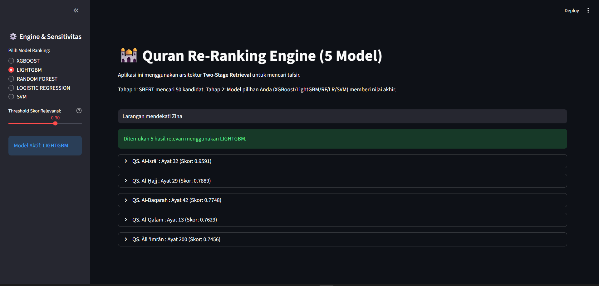

# Al- Qur'an Information Retrieval System

Sistem pencarian tafsir Al-Qur'an berbasis **Two-Stage Retrieval** yang mengintegrasikan SBERT dan Machine Learning untuk menjembatani *lexical gap* antara bahasa sehari-hari dengan teks formal tafsir.



## Daftar Isi

- [Tentang Proyek](#tentang-proyek)
- [Fitur Utama](#fitur-utama)
- [Arsitektur Sistem](#arsitektur-sistem)
- [Instalasi](#instalasi)
- [Cara Penggunaan](#cara-penggunaan)
- [Struktur Proyek](#struktur-proyek)
- [Pipeline Penelitian](#pipeline-penelitian)
  - [Text Preprocessing](#2-text-preprocessing)
- [Performa Model](#performa-model)
- [Uji Skenario](#uji-skenario)
- [Dataset](#dataset)
- [Teknologi](#teknologi)
- [Kontributor](#kontributor)
- [Lisensi](#lisensi)

## Tentang Proyek

Proyek tugas akhir ini mengembangkan sistem Information Retrieval (IR) untuk mencari tafsir Al-Qur'an menggunakan pendekatan hibrida yang menggabungkan kekuatan pencarian semantik (SBERT) dan peringkat berbasis machine learning. Sistem ini dirancang untuk memahami pertanyaan dalam bahasa natural dan mengembalikan ayat beserta tafsirannya yang paling relevan.

### Catatan Development

**Training & Evaluasi**: Mayoritas proses training model dan evaluasi dilakukan di platform cloud computing seperti **Google Colab** dan **Kaggle Notebooks** untuk memanfaatkan resource GPU yang lebih besar. Notebook `.ipynb` yang ada di repository ini merepresentasikan kode yang dijalankan di platform tersebut.

**Output Notebook**: Sebagian besar cell di dalam notebook tidak menampilkan output karena eksekusi dilakukan di environment cloud. Model hasil training kemudian di-download dan disimpan ke folder `models/` untuk deployment lokal via Streamlit.

## Fitur Utama

- **Two-Stage Retrieval Architecture**: Kombinasi SBERT retrieval dan ML re-ranking
- **Hybrid Features**: Integrasi fitur semantik (SBERT) dan leksikal (BM25, Jaccard, Overlap)
- **Multiple Models**: Mendukung 5 model ranking (XGBoost, LightGBM, Random Forest, Logistic Regression, SVM)
- **Streamlit Web App**: Interface interaktif untuk pencarian real-time
- **High Accuracy**: nDCG@3 mencapai 0.9648 dengan model XGBoost
- **Indonesian Language Support**: Optimized untuk query berbahasa Indonesia

## Arsitektur Sistem

Sistem menggunakan **Two-Stage Retrieval Architecture**:

```
Query User
    ↓
[Stage 1: SBERT Retrieval]
    → Mencari top-50 kandidat dari 6,246 ayat
    ↓
[Feature Extraction]
    → SBERT Similarity
    → BM25 Score
    → Jaccard Similarity
    → Overlap Coefficient
    ↓
[Stage 2: ML Re-Ranking]
    → XGBoost/LightGBM/RF/LR/SVM
    ↓
Top-5 Hasil Terurut
```

## Instalasi

### Prasyarat

- Python 3.8+
- pip atau conda

### Langkah Instalasi

```bash
# Clone repository
git clone https://github.com/yourusername/fp-quran-ir-query-tafsir.git
cd fp-quran-ir-query-tafsir

# Install dependencies
pip install -r requirements.txt

# Download NLTK stopwords (otomatis saat pertama kali run)
```

## Cara Penggunaan

### Menjalankan Web Application

```bash
streamlit run app/streamlit_app.py
```

Aplikasi akan terbuka di browser pada `http://localhost:8501`

### Melatih Ulang Model

Jalankan notebook secara berurutan:

```bash
# 1. Eksplorasi data
notebooks/01_eda_dataset_alquran.ipynb

# 2. Generate synthetic queries
notebooks/02_create_query_final.ipynb

# 3. Hard negative mining
notebooks/03_hard_negative_labeling.ipynb

# 4. Feature engineering
notebooks/04_feature_extraction.ipynb

# 5. Train models
notebooks/05_Train_ensemble.ipynb
notebooks/06_Train_single_model.ipynb

# 6. Evaluasi
notebooks/07_Evaluasi_Ensamble&Single_Model.ipynb
```

**Catatan Reproduksi**:
- Notebook yang tersedia di repository ini **merepresentasikan kode yang dijalankan di Google Colab/Kaggle**
- Sebagian besar cell tidak memiliki output karena eksekusi dilakukan di environment cloud dengan akses GPU
- Untuk mereproduksi hasil training:
  1. Upload notebook ke Google Colab atau Kaggle
  2. Pastikan menggunakan GPU runtime (T4/P100 recommended)
  3. Jalankan semua cell secara berurutan
  4. Download model hasil training (.pkl, .json, .pt) ke folder `models/`
- Model pre-trained sudah tersedia di folder `models/` untuk langsung digunakan dengan Streamlit

## Struktur Proyek

```
fp-quran-ir-query-tafsir/
├── app/
│   ├── streamlit_app.py          # Main application
│   └── config_example.yaml        # Configuration template
├── data/
│   ├── raw/                       # Raw Al-Quran dataset
│   └── processed/                 # Processed datasets
│       ├── tafsir_clean.csv       # Clean tafsir data
│       └── dataset_training_*.csv # Training data
├── models/
│   ├── sbert_finetuned_quran/     # Fine-tuned SBERT
│   ├── corpus_embeddings.pt       # Pre-computed embeddings
│   ├── xgboost_best_model.json    # XGBoost model
│   ├── lightgbm.pkl               # LightGBM model
│   ├── randomforest.pkl           # Random Forest model
│   ├── logisticregression.pkl     # Logistic Regression
│   └── svm.pkl                    # SVM model
├── notebooks/                     # Jupyter notebooks
└── requirements.txt               # Python dependencies
```

## Pipeline Penelitian

### 1. Konstruksi Dataset & Auto-Labeling

Karena keterbatasan data label relevansi, sistem menggunakan **weak supervision**:

- **Data Dasar**: Dataset Al-Qur'an Indonesia (6,236 ayat dengan tafsir)
- **Synthetic Query Generation**: Menggunakan LLM (DeepSeek V3) untuk generate ~42,000 kueri
- **Hard Negative Mining**: Strategi *Skip Top-5* untuk mining 3 hard negatives per query
- **Output**: ~170,000 pasangan query-tafsir dengan label

### 2. Text Preprocessing

Sebelum ekstraksi fitur, sistem melakukan preprocessing pada query dan dokumen tafsir:

**Tahapan Preprocessing untuk Fitur Leksikal (BM25, Jaccard, Overlap)**:

- **Lowercasing**: Mengubah semua teks menjadi huruf kecil
- **Punctuation Removal**: Menghapus tanda baca menggunakan `string.punctuation`
- **Tokenization**: Memecah teks menjadi token kata
- **Stopword Removal**: Menghilangkan kata-kata umum bahasa Indonesia (menggunakan NLTK stopwords)

**Preprocessing untuk SBERT**:

- SBERT menggunakan tokenizer internal (SentencePiece) yang sudah ter-built-in
- Tidak memerlukan preprocessing manual karena model sudah di-fine-tune dengan teks asli

### 3. Ekstraksi Fitur Hibrida

Setiap pasangan kueri-tafsir dikonversi menjadi **4 fitur numerik**:

| Fitur               | Tipe     | Deskripsi                         | Preprocessing                |
| ------------------- | -------- | --------------------------------- | ---------------------------- |
| SBERT Similarity    | Semantik | Cosine similarity dari embeddings | SBERT internal tokenizer     |
| BM25 Score          | Leksikal | Probabilistic ranking function    | Lowercase + stopword removal |
| Jaccard Similarity  | Leksikal | Set intersection/union ratio      | Lowercase + stopword removal |
| Overlap Coefficient | Leksikal | Normalized word overlap           | Lowercase + stopword removal |

### 4. Pelatihan Model (Learning to Rank)

**Pendekatan**: Pointwise Learning to Rank (klasifikasi biner)

**Model yang Diuji**:

- Ensemble: XGBoost, LightGBM, Random Forest
- Single: SVM, Logistic Regression

**Model Terbaik**: XGBoost dengan hyperparameter tuning

### 5. Deployment

- **Framework**: Streamlit
- **Inference**: Real-time two-stage retrieval
- **Latency**: ~1-2 detik per query

## Performa Model

### Hasil Evaluasi (Test Set)

| Kategori Model | Algoritma | nDCG@3 | MRR | Recall@3 |
| -------------- | --------- | ------ | ---- | -------- |
| **Ensemble Learning** | **XGBoost** | **0.9648** | **0.9531** | **0.9991** |
| Ensemble Learning | LightGBM | 0.9642 | 0.9522 | 0.9991 |
| Ensemble Learning | Random Forest | 0.9642 | 0.9521 | 0.9991 |
| Single Learning | Logistic Regression | 0.9587 | 0.9450 | 0.9987 |
| Single Learning | SVM | 0.9497 | 0.9327 | 0.9989 |

**Model Terbaik**: XGBoost (Ensemble Learning) dengan nDCG@3 = 0.9648 dan MRR = 0.9531

### Ablation Study

Peningkatan performa dengan integrasi fitur hibrida:

- **MAP improvement**: +21.73% vs BM25-only baseline
- **nDCG@3 improvement**: +15.42% vs SBERT-only baseline

### Kontribusi Fitur terhadap Performa

| Konfigurasi Fitur     | Avg MAP          | ROC AUC          | Improvement (vs Keyword) |
| --------------------- | ---------------- | ---------------- | ------------------------ |
| Lexical Only          | 0.5509           | 0.7287           | 0%                       |
| Semantic Only         | 0.6036           | 0.7545           | +9.57%                   |
| **Full Hybrid** | **0.6706** | **0.8068** | **+21.73%**        |

## Uji Skenario

### Pengujian Robustness Terhadap Variasi Kata (Sinonim & Morfologi)

Skenario ini diimplementasikan sebagai bentuk *stress-test* kualitatif untuk mengevaluasi ketahanan sistem dalam menghadapi kendala *vocabulary mismatch*. Fenomena ini merupakan tantangan fundamental dalam sistem Information Retrieval (IR) konvensional di mana kueri pengguna tidak memiliki irisan kata kunci eksak dengan dokumen target.

Dalam konteks tafsir Al-Qur'an, masalah ini semakin krusial karena terdapat kesenjangan bahasa (*lexical gap*) antara bahasa percakapan pengguna awam dengan istilah teologis teknis formal. Untuk menguji kemampuan adaptasi sistem, dilakukan pengujian pada **12 sampel kueri** yang dimodifikasi secara manual untuk mencakup variasi morfologi dan penggunaan sinonim.

#### Hasil Evaluasi Robustness (Model XGBoost)

| Metrik Evaluasi                      | Nilai Hasil      |
| ------------------------------------ | ---------------- |
| **Precision@5 (P@5)**          | **75.00%** |
| **Mean Reciprocal Rank (MRR)** | **0.5069** |
| **nDCG@5**                     | **0.5686** |

#### Analisis Hasil Robustness

**Stabilitas Sistem**:

- Nilai **P@5 = 75.00%** membuktikan bahwa meskipun menghadapi ketidaksamaan kosakata yang signifikan, sistem tetap mampu menyajikan dokumen relevan pada posisi teratas hasil pencarian
- Kemampuan ini dimungkinkan oleh penggunaan *dense retrieval* berbasis SBERT yang secara efektif menangkap kedekatan makna kontekstual melampaui simbol tekstual mentah

**Keunggulan Pendekatan Hibrida**:

- Berbeda dengan pendekatan leksikal murni, sistem hibrida ini mengintegrasikan fitur semantik untuk mempertahankan relevansi kueri implisit
- Model berhasil memetakan kueri dengan sinonim (contoh: "denda bersumpah palsu" → dokumen "kafarat") secara empiris memvalidasi bahwa kombinasi fitur hibrida merupakan solusi tangguh untuk menangani kueri kompleks
- Representasi vektor padat (*dense representations*) memiliki keunggulan dalam menangani kueri yang membutuhkan pemahaman makna lebih dalam dibandingkan pencocokan string sederhana

### Analisis Tingkatan Semantik

Evaluasi dilakukan untuk mengidentifikasi batas kemampuan model hibrida dalam menangani berbagai tingkatan abstraksi kueri pengguna. Analisis ini mengidentifikasi fenomena *semantic gap*, yaitu kondisi di mana representasi vektor mungkin gagal menangkap maksud kueri yang bersifat implisit atau teologis mendalam.

Kueri dikategorikan menjadi tiga tingkat kesulitan:

- **Low-Level**: Kata kunci eksplisit
- **Mid-Level**: Konsep spesifik
- **High-Level**: Abstrak/tematik

### Hasil Evaluasi Berdasarkan Tingkatan Semantik

| Kategori Semantik    | Deskripsi                   | nDCG@10          | MRR    | Recall@10        |
| -------------------- | --------------------------- | ---------------- | ------ | ---------------- |
| **Low-level**  | Pencarian keyword eksplisit | 0.6255           | 0.4259 | **0.8333** |
| **Mid-level**  | Pencarian konsep/deskriptif | **0.6334** | 0.2708 | 0.4250           |
| **High-level** | Pencarian abstrak           | 0.5223           | 0.3667 | 0.5000           |

### Analisis Hasil

**Performa Low-Level (Keyword Eksplisit)**:

- Sistem menunjukkan performa retrieval yang sangat handal dengan **Recall@10 = 0.8333**
- Integrasi fitur leksikal BM25 bekerja optimal dalam menjaring dokumen ketika terdapat irisan kata kunci eksplisit antara kueri dan teks tafsir
- Skor nDCG@10 yang tinggi membuktikan model XGBoost konsisten menempatkan ayat paling relevan di urutan teratas

**Performa Mid-Level (Konsep Deskriptif)**:

- **nDCG@10 tertinggi (0.6334)** menunjukkan model perankingan hibrida sangat presisi dalam mengurutkan dokumen untuk kueri berbasis konsep
- Penurunan drastis pada **MRR (0.2708)** dan **Recall@10 (0.4250)** mengindikasikan model jarang menemukan jawaban benar tepat di posisi pertama untuk kueri konseptual
- Trade-off antara precision dan recall terlihat jelas pada level ini

**Performa High-Level (Abstrak/Tematik)**:

- Degradasi performa paling signifikan dengan **nDCG@10 = 0.5223**
- Absennya kata kunci spesifik menyebabkan fitur leksikal memiliki nilai relevansi rendah
- Sistem sepenuhnya bergantung pada fitur semantik SBERT
- Meskipun representasi vektor padat (*dense representations*) unggul dalam menangkap kedekatan makna, model tetap menghadapi tantangan besar dalam melakukan inferensi logika pada konsep teologis yang kompleks

**Kesimpulan**:
Analisis ini mengonfirmasi adanya *trade-off* di mana sistem memiliki Recall tinggi pada pencarian berbasis kata kunci, namun menghadapi tantangan presisi pada kueri abstrak yang memerlukan pemahaman konteks mendalam.

## Dataset

### Sumber Data

- **Dataset**: Aban R. Al-Quran Indonesia Dataset. Kaggle. 2024. Available from: https://www.kaggle.com/datasets/ronnieaban/alquran
- **Jumlah Ayat**: 6,236 ayat dengan terjemahan dan tafsir
- **Bahasa**: Indonesia
- **Format**: CSV dengan kolom: surah, ayah, arabic_text, indonesian_translation, tafsir

### Data Sintetik

- **Synthetic Queries**: ~42,000 kueri (generated dengan DeepSeek V3)
- **Training Pairs**: ~170,000 pasangan query-tafsir (positive + hard negatives)
- **Split**: 80% train, 10% validation, 10% test

## Teknologi

### Core Libraries

- **Sentence Transformers**: Fine-tuned SBERT untuk semantic search
- **XGBoost**: Gradient boosting untuk ranking
- **LightGBM**: Alternatif fast gradient boosting
- **Streamlit**: Web application framework
- **Rank-BM25**: Implementation BM25 algorithm
- **PyTorch**: Deep learning backend

### Development Tools

- **Jupyter Notebook**: Eksperimen dan analisis
- **Pandas**: Data manipulation
- **Scikit-learn**: Model evaluation metrics
- **NLTK**: Text preprocessing

## Kontributor

Proyek ini dikembangkan oleh Kelompok 8 - Data Mining, Institut Teknologi Sepuluh Nopember (ITS):

1. **Muhammad Farhan** (5054241018)
2. **Muhammad Dayyan Ghazanfar Latief** (5054241036)
3. **Izzah Naufalia Adila** (5054241021)

## Acknowledgments

- Aban R. untuk dataset Al-Qur'an Indonesia di Kaggle
- Sentence Transformers library oleh UKPLab
- Inspirasi dari paper InPars (Bonifacio et al., 2022)

**Note**: Proyek ini adalah bagian dari Tugas Akhir di Teknik Informatika ITS untuk pengembangan sistem Information Retrieval pada domain Al-Qur'an berbahasa Indonesia.
